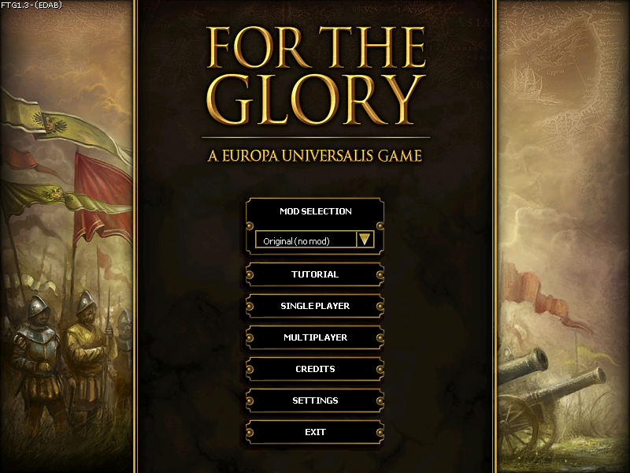
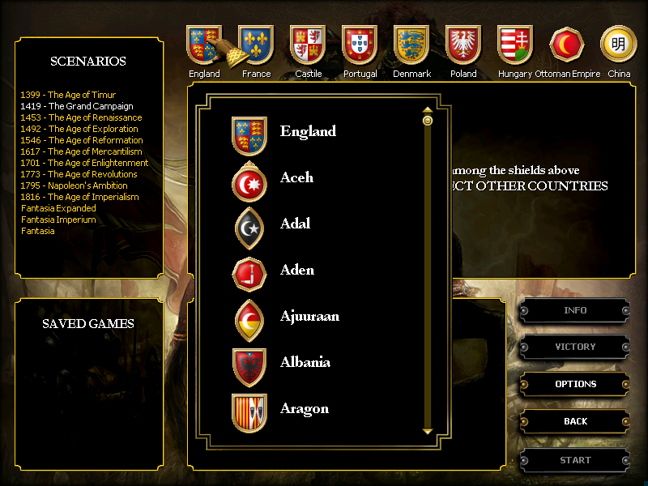
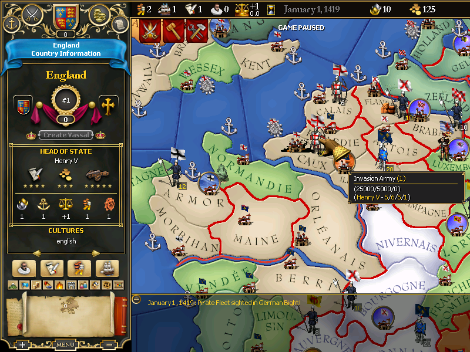

## Welcome to the For the Glory game development blog!
This blog will cover general background of how For the Glory came to be, its general architecture, and stories of development and specific bugfixes over the years since I acquired the engine source code in June 2008.

## For the Glory background
For the Glory is a product of the Europa Engine licensing program begun by Paradox Interactive in spring of 2008. Under this program, prospective developers could apply for licenses to modify the engines of Europa Universalis 2 (EU2), Victoria, and Hearts of Iron 2 (HOI2), and use them in standalone games.

For the Glory is based on EU2, the only such game that was successfully released. No games based on Victoria were ever completed. Two games based on HOI2 (Darkest Hour and Arsenal of Democracy) were successfully released, plus an addon (Iron Cross) which was compatible with both licensed games and the original game.

  
  

For the Glory was developed and released by [Crystal Empire Games](http://crystalempiregames.com), a small group of independent developers spread across five countries.
